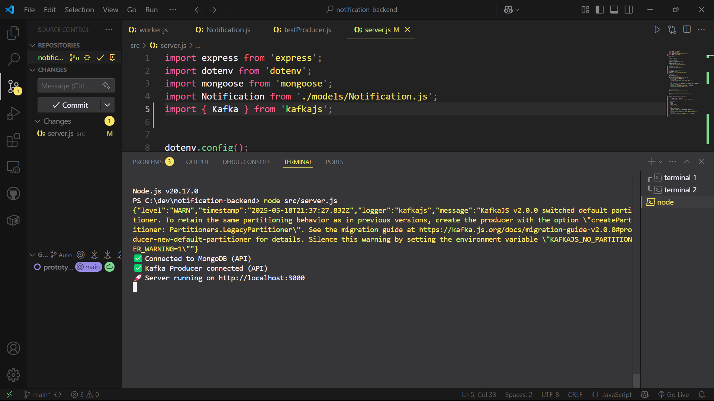
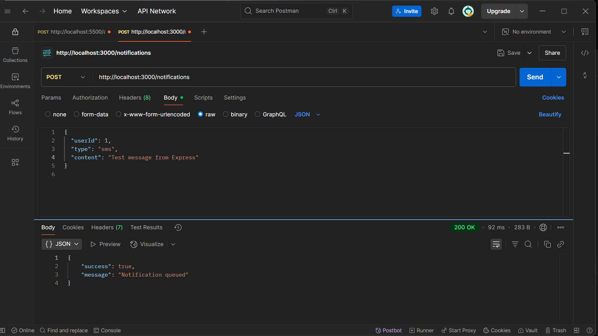
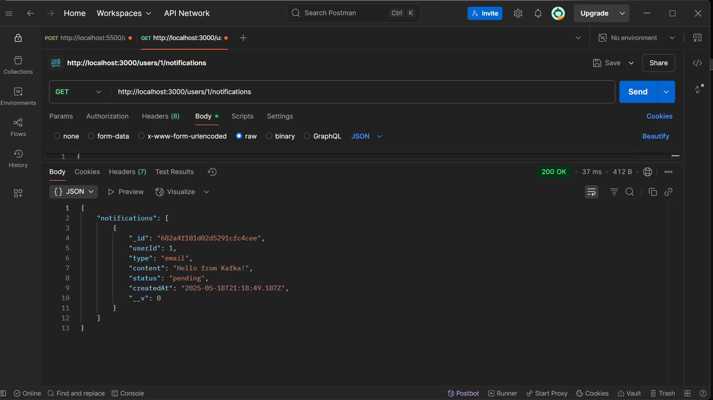
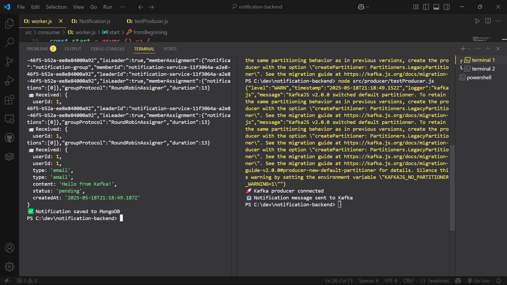

# Notification Service

A backend notification service built with **Node.js**, **Kafka**, and **MongoDB** that supports:

* Queued delivery of Email/SMS/In-App notifications
* Kafka-based producer-consumer model
* MongoDB for persistent storage
* REST API to submit and retrieve notifications

---

## 🚀 Features

### 🔧 API Endpoints

* `POST /notifications`
  Queue a new notification (via Kafka)

* `GET /users/:id/notifications`
  Fetch all notifications for a specific user

---

## ⚙️ Tech Stack

* **Node.js** with **Express.js**
* **Kafka** (Docker-based, using `kafkajs`)
* **MongoDB** with **Mongoose**
* **Dotenv** for config management

---

## 📁 Folder Structure

```
src/
├── consumer/worker.js         # Kafka consumer - saves to MongoDB
├── producer/testProducer.js   # (Legacy) test sender
├── models/Notification.js     # Mongoose schema
├── db/mongo.js                # MongoDB connection
├── server.js                  # Express server with POST/GET routes
```

---

## 🛠 Setup Instructions

### 1. Clone & Install

```bash
git clone <your-repo-url>
cd notification-backend
npm install
```

### 2. Environment Variables

Create a `.env` file:

```env
MONGO_URI=mongodb://localhost:27017
KAFKA_BROKER=localhost:9092
PORT=3000
```

### 3. Start Kafka + Mongo via Docker

```bash
docker compose up -d
```

### 4. Start the Kafka consumer

```bash
node src/consumer/worker.js
```

### 5. Start the API server

```bash
node src/server.js
```

---

## ✅ Usage

### Send Notification (POST)

```http
POST /notifications
Content-Type: application/json

{
  "userId": 1,
  "type": "email",
  "content": "Welcome to SoftSell!"
}
```

### Get User Notifications (GET)

```http
GET /users/1/notifications
```

---

## 📷 Project Screenshots

### ✅ Express Server Running



### ✅ Sending Notification via POST `/notifications`



### ✅ Fetching Notifications via GET `/users/1/notifications`



### ✅ Kafka Consumer Logs + MongoDB Save



---

## 🧠 Future Enhancements

* Retry & Dead-letter queue support
* Admin panel to view failed messages
* Logging & metrics dashboard
* Role-based user auth
* Dockerized API

---

## 👨‍💻 Author

Built by Aryan Kapoor — [GitHub](https://github.com/meowkapoor)

Feel free to fork, contribute or reach out!
